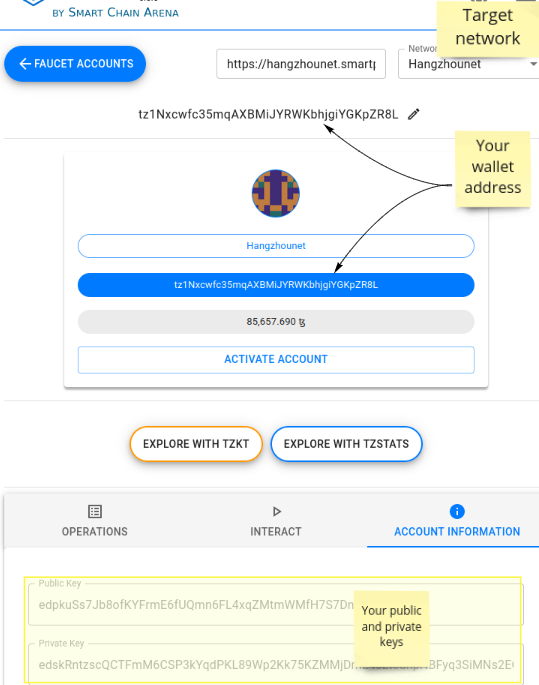

### Context

To make the application able to send transactions to the blockchain, you will need a
wallet. Your wallet is your identity on the Blockchain, it is composed of:

- The wallet address
- The wallet private key
- The wallet public key

### Create a wallet

Tezos provide public testing blockchain network. A _Faucet wallet_ will be used, once created it
will own directly a lot of tezes token, so it can be used for testing without taking care about
required gas fee for executing transactions.

- Go to https://teztnets.xyz/
  - Click on the target Blockchain network **faucet link**
    (ex: [Hangzhounet faucet](https://teztnets.xyz/hangzhounet-faucet))
  - Click on `Get Hangzounet ꜩ` button
  - Copy your generated **activation key**
- Go to [SmartPy Wallet](https://smartpy.io/wallet) page
- Click `Faucet accounts` > `Add account`
- Paste the **activation key** and click `Save Faucet` button
- Go back on the faucet account page and click on the `Open` button of the created wallet
  - Select your network (ex: _Hangzounet_)
  - Click on `Activate Account` button, then on `Reveal account` button
  - Keep your **wallet address**
  - You can find your **wallet private key** and **wallet public key** by click on
    the `Account information` tab
    

### Import your wallet in the secured TAG Vault:

- Open a terminal
- Update and execute the following commands with your private and public keys:

```
export PUBLIC_KEY=`echo "XXX_PUBLIC_KEY" | base58 -d -c | xxd -p -c 1000 | sed 's/^.\{8\}//g' | xxd -r -p | base64 | tr -d '\n'`
export PRIVATE_KEY=`echo "XXX_PRIVATE_KEY" | base58 -c -d | xxd -p -c 1000 | sed 's/^.\{8\}//g' | xxd -r -p | base64 | tr -d '\n'`
export BACKUP=`echo "{\"policy\":{\"name\":\"admin\",\"keys\":{\"1\":{\"key\":\""$PRIVATE_KEY"\",\"hmac_key\":\"vIeCF/XQkefiuNXKtmBKAQRjLwbkIiQyw21n9w3pBAI=\",\"time\":\"2021-04-26T14:01:57.185354936Z\",\"ec_x\":null,\"ec_y\":null,\"ec_d\":null,\"rsa_key\":null,\"public_key\":\""$PUBLIC_KEY"\",\"convergent_version\":0,\"creation_time\":1619445717}},\"derived\":false,\"kdf\":0,\"convergent_encryption\":false,\"exportable\":true,\"min_decryption_version\":1,\"min_encryption_version\":0,\"latest_version\":1,\"archive_version\":1,\"archive_min_version\":0,\"min_available_version\":0,\"deletion_allowed\":false,\"convergent_version\":0,\"type\":2,\"backup_info\":{\"time\":\"2021-04-26T14:02:23.688590588Z\",\"version\":1},\"restore_info\":null,\"allow_plaintext_backup\":true,\"version_template\":\"\",\"storage_prefix\":\"\"},\"archived_keys\":{\"keys\":[{\"key\":null,\"hmac_key\":null,\"time\":\"0001-01-01T00:00:00Z\",\"ec_x\":null,\"ec_y\":null,\"ec_d\":null,\"rsa_key\":null,\"public_key\":\"\",\"convergent_version\":0,\"creation_time\":0},{\"key\":\""$PRIVATE_KEY"\",\"hmac_key\":\"vIeCF/XQkefiuNXKtmBKAQRjLwbkIiQyw21n9w3pBAI=\",\"time\":\"2021-04-26T14:01:57.185354936Z\",\"ec_x\":null,\"ec_y\":null,\"ec_d\":null,\"rsa_key\":null,\"public_key\":\""$PUBLIC_KEY"\",\"convergent_version\":0,\"creation_time\":1619445717}]}}" | base64 | tr -d '\n'`
echo "vault write transit/restore/admin backup=$BACKUP"
```

- Copy the printed `vault write ...` and paste it in your environment `helm values` file as a value
  of the `collaborate-dapp.tezos-api-gateway.vault.customInitScript` property.

This is will import your private and public wallet keys in a secured delegated vault. These keys
will be used by the
underlying [TAG API](https://gitlab.com/xdev-tech/xdev-enterprise-business-network/tezos-api-gateway/-/blob/develop/README.md)
for signing your transactions to the Blockchain.
