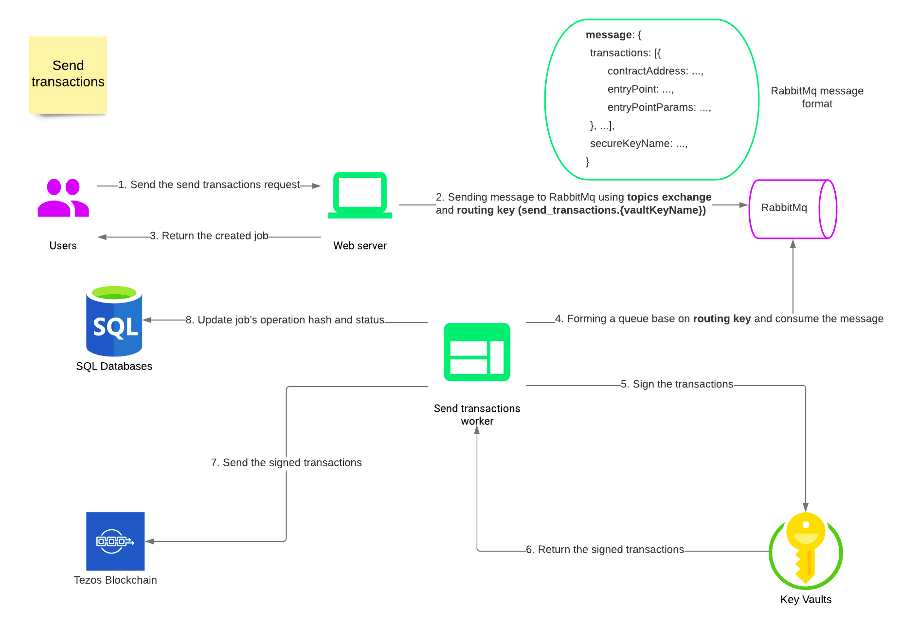
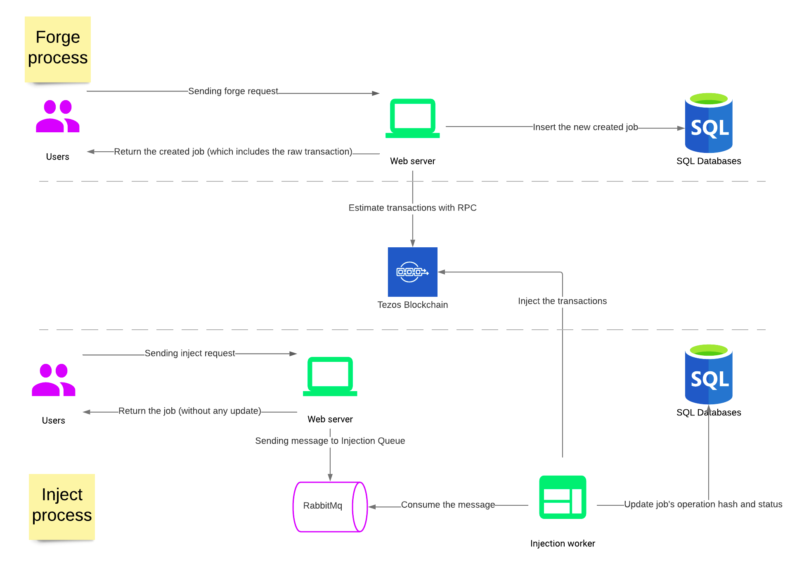
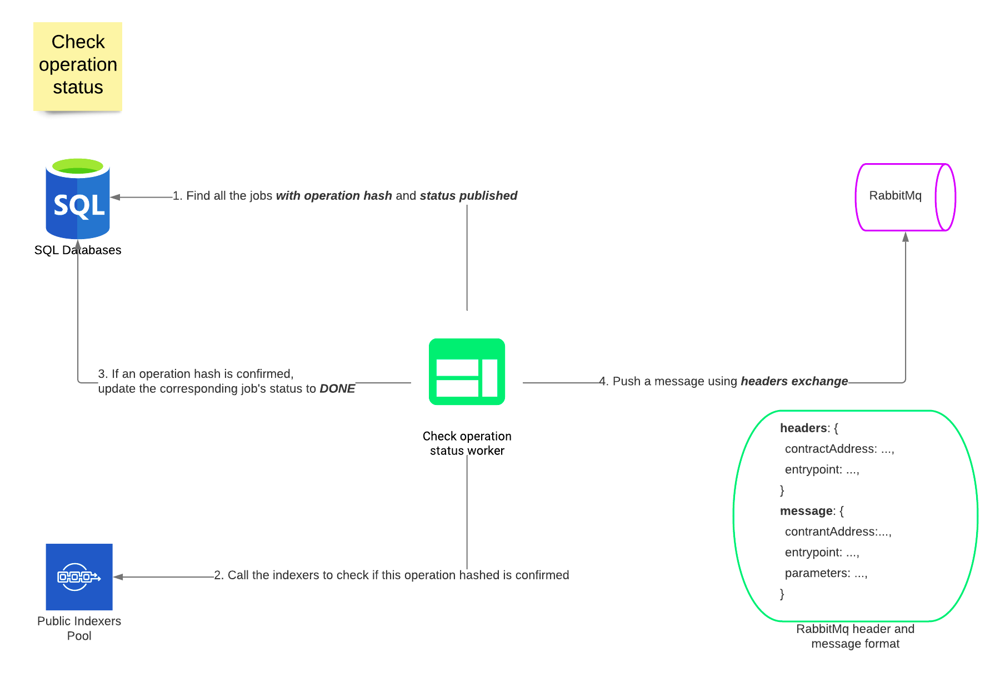

# TEZOS API GATEWAY WORKFLOW

There are 2 main objectives of Tezos API Gateway project:

- Interact with Tezos smart contract
- Follow up an operation

The diagrams shown in this documentation illustrate the asynchronous mode, where RabbitMQ is used to transfer messages between the web server and the workers (for the injection and send processes).

The synchronous mode doesn't use the workers or RabbitMQ : all actions are processed by the web server.

## Definitions

### JOBS

A job is created after a request to interact with Tezos smart contract sent to Tezos Api Gateway (through **forge** or **send transactions**)

<u>**_JOB STATUS_**</u>

The status of the job:

| Status    | Explanation                                                                                                          |
| --------- | -------------------------------------------------------------------------------------------------------------------- |
| CREATED   | The job is just created, which means a request to **forge/send** is just sent                                        |
| PUBLISHED | The request to interact with Tezos smart contract is published to Tezos (which means **_operation hash_** is formed) |
| DONE      | The job is done when the operation associated to it is confirmed on Tezos Block Chain                                |

## Interact with Tezos smart contract

There are 2 ways that user can interact with Tezos smart contract:

### 1. Send transactions

Tezos Api Gateway supports the **Vault Signer**.

If user want to perform the signing inside the Tezos Api Gateway using **Vault**, **send transactions** option is preferred.
**Send transactions** will handle all the steps to submit the operation to Tezos Block Chain (forge, sign, pre-apply and inject).

<u>_DIAGRAM_</u>

<u>_SERVICES INVOLVE_</u>

- **[Generic][1]/[Generated][2] API Web Server**
- **[Send transactions worker][4]**

### 2. Forge and Injection

For any reasons that user does not want to use **Vault Signer**, or want to perform the signing process outside the system,
he/she can choose **forge and injection option**. This process break the interaction into 2 steps:

- Forge: Using the parameters of the forge operation, a new raw transaction is created. The raw transaction requires the signature and can be sent to the blockchain at a later stage.
- Inject: Pre-apply the transactions and inject the operation using the signed raw transaction and signature.

<u>_DIAGRAM_</u>

<u>_SERVICES INVOLVE_</u>

- **[Generic][1]/[Generated][2] API Web Server**
- **[Injection worker][3]**

### Follow up an operation

After submitting an operation to Tezos Blockchain, user might want to **_check the operation status_** (confirmed/failed) and build an alert system for that.
**_Check operation status worker_** is built to serve this goal.

The worker will get the operation hash of the jobs with status **PUBLISHED**, then check the operation status by using **_Indexer Pool_**.
If an operation is successfully **confirmed** on Tezos Blockhain, publish a message with the operation details.

<u>_DIAGRAM_</u>

<u>_SERVICES INVOLVE_</u>

- **[Check operation status worker][5]**

[1]: src/processes/web/README.md
[2]: src/processes/generated-api-web/README.md
[3]: src/processes/workers/injection/README.md
[4]: src/processes/workers/send-transactions/README.md
[5]: src/processes/workers/check-operation-status/README.md
